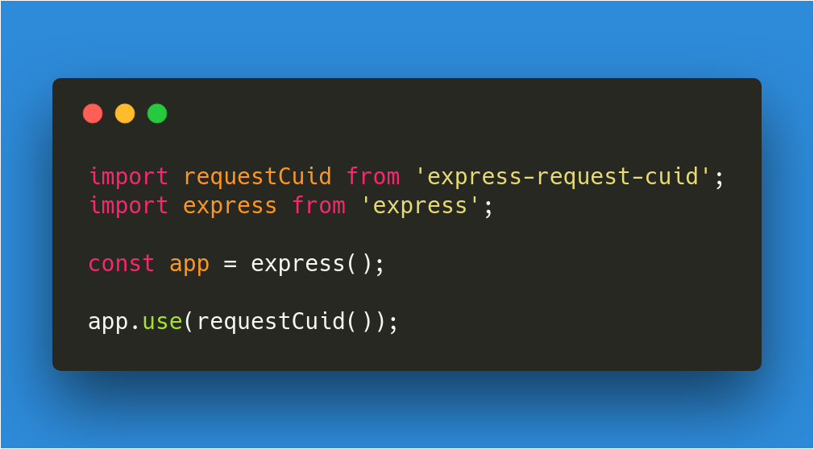

# express-request-cuid

# [](https://github.com/nicolaischmid/express-request-cuid)


## Overview
[express-required-cuid](https://github.com/nicolaischmid/express-request-cuid) provides a simple express/connect middleware for creating a new [cuid](https://github.com/ericelliott/cuid) for each request and appending an `x-request-id` header to the request and adding the `requestId` property to the request-object.

## Usage
Just like above:

```javascript
import requestCuid from 'express-request-cuid';
import express from 'express';

const app = express();

app.use(requestCuid());
```
Import the module and use it. It works with CJS `require` as well. For any additional configuration, please open a new [issue](https://github.com/nicolaischmid/express-request-cuid)

## Have fun coding!

